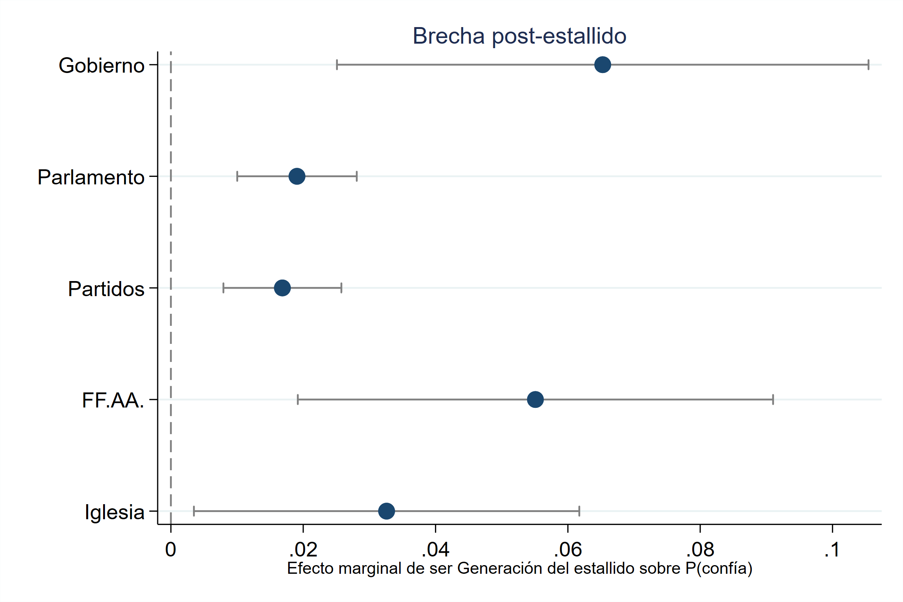
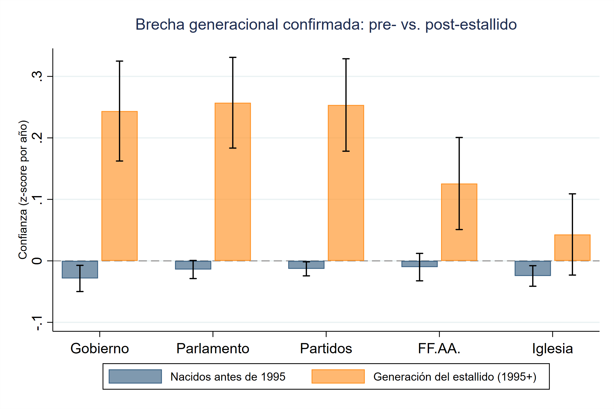
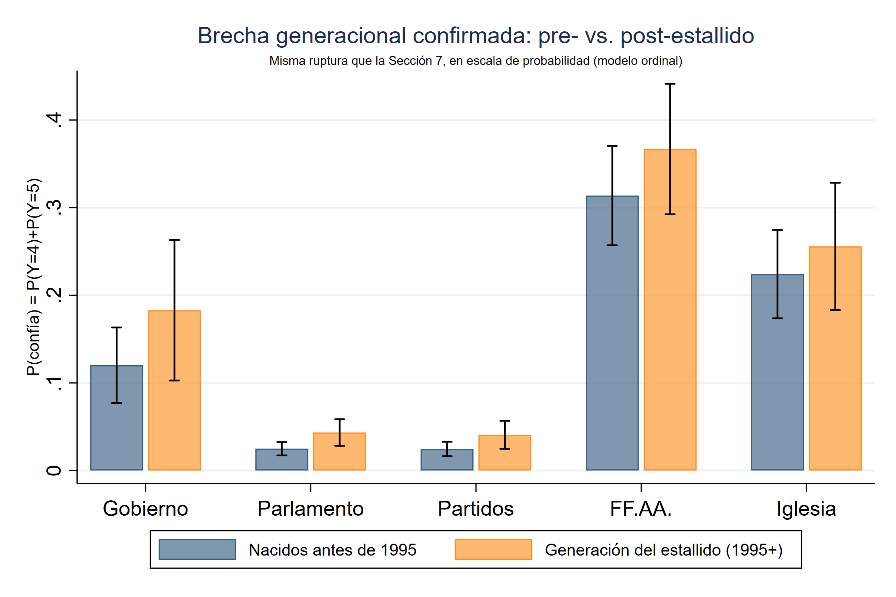

# La confianza ya viene: Quiebres generacionales en la confianza institucional del Chile de los últimos 20 años

Gonzalo Bustamante Rojas y Alonso Quintero Contreras

editor del repo: [Gonzalo Bustamante Rojas](https://brojasgonzalo.github.io/)

## Resumen de la metodología: 

Análisis edad-período-cohorte de confianza institucional (Gobierno, Parlamento, Partidos, FF.AA., Iglesia) sobre el panel Bicentenario armonizado 2006-2025.

- **Pooled dataset**: panel armonizado, cohorte de nacimiento 1930-2007, edad 18-85, `svyset` con ponderador y estrato.
- **Misma variable, tres estimaciones**: cada institución se modela como binaria (top-2-box), continua (z-score por año) y ordinal completa (1-5).
- **Tres modelos mixtos con intercepto aleatorio de período**:
  - `mixed` para la variable continua
  - `melogit` para la binaria
  - `meologit` (ordinal) para la escala completa —> especificación principal
- **Propuesta generacional, tres esquemas** 
  1. Importado: taxonomía Silenciosa/Boomer/X/Millennial/Z
  2. Propio: periodización histórico-local (Pre-masificación / Estado desarrollista / Dictadura-transición / Democracia neoliberal / Generación del estallido)
  3. Corte único: puntos de quiebre político puntual (plebiscito 1988, retorno a la democracia 1990)
- **Identificación de diferencias generacionales (Wald)**: test de Wald conjunto sobre los 13 coeficientes de cohorte, más LR test (modelo completo vs. reducido). 
- **Wald para el quiebre generacional**: tests dentro-bloque y de frontera para los tres esquemas, más test frontera-a-frontera de las 13 fronteras quinquenales consecutivas.

────────────────────────────────────────────

## General

Análisis edad-período-cohorte (APC) de la confianza institucional en Chile (Gobierno, Parlamento, Partidos, Fuerzas Armadas, Iglesia), usando el panel armonizado de la Encuesta Bicentenario PUCV (2006-2025). La pregunta central:

*¿Existe una ruptura generacional real en la confianza institucional chilena, distinta del efecto de la edad o la coyuntura del momento (efecto de período), y si existe, dónde se ubica?*

por lo tanto:

> **1. ¿Existe algún efecto de cohorte?**
>
> **2. ¿Dónde está exactamente el quiebre?**

*Variables dependientes*:

Se utilizaron escalas de confianza estilo Likert 1-5.

| Institución | N observaciones | Olas con datos | Años sin dato |
|---|---|---|---|
| Gobierno | 24.421 | 13 / 18 | 2007, 2008, 2009, 2013, 2014 |
| Parlamento | 28.292 | 15 / 18 | 2007, 2008, 2009 |
| Partidos | 26.306 | 14 / 18 | 2007, 2008, 2009, 2013 |
| FF.AA. | 26.354 | 14 / 18 | 2007, 2008, 2009, 2013 |
| Iglesia | 28.375 | 15 / 18 | 2007, 2008, 2009 |

<p align="center"></p>

*Modelado*

El modelo enfrenta el problema clásico de identificación edad-período-cohorte (Mason, et al., 1973). dado que la cohorte se define como período menos edad, la inclusión simultánea de las tres variables como categóricas en una misma regresión produce una dependencia lineal exacta. Durante años el modelo lineal generalizado restringido (CGLIM), resolvió la indeterminación mediante la imposición de una restricción de igualdad entre dos categorías., y restricciones alternativas igualmente plausibles pueden producir conclusiones sustantivas opuestas a partir de los mismos datos (Mason et al., 1973). El presente estudio adopta la alternativa de enfoque jerárquico edad-período-cohorte (HAPC) de Yang y Land (2006), donde el período se especifica como efecto aleatorio de nivel 2 dentro de un modelo multinivel (logístico ordinal, aunque también se compararon resultados de modelos logísticos y lineales multinivel para la versión dicotómica y contínua de la variable, respectivamente), en lugar de como un conjunto de variables indicadoras fijas. Bajo esta especificación se estima un único parámetro de varianza para las 18 olas del panel, en vez de 18 coeficientes independientes, lo que resuelve la dependencia lineal sin requerir restricciones de igualdad arbitrarias. La edad se especifica como efecto fijo con un término cuadrático, que permite una relación no lineal con la variable dependiente. La cohorte se mantiene como efecto fijo categórico, divergiendo del HAPC clásico de Yang y Land (siguiendo la solución de Bargsted y Maldonado, 2018), en el cual tanto período como cohorte se especifican como aleatorios. esta divergencia responde principalmente al objetivo del análisis, que requiere coeficientes estimables para cohortes específicas con el fin de testear fronteras generacionales mediante pruebas de Wald, procedimiento incompatible con una especificación de cohorte como parámetro de varianza único.

La propuesta de análisis generacional se hace de tres esquemas de análisis a partir de la literatura (1) taxonomía generacional importada (Silenciosa/Boomer/Generación X/Millennial/Generación Z), popular en reportes chilenos (Didier, 2017; del Solar y Fernández, 2024) criticada por ser fronteras sin anclaje en la experiencia histórica local; (2) una periodización histórico-local propia (Pre-masificación educativa, Estado desarrollista, Dictadura-transición, Democracia neoliberal y Generación del estallido), inspirada en el argumento de Araujo y Martuccelli (2012) de que la subjetividad se forma en condiciones históricas concretas y extendida con la lógica de "años impresionables" de Mannheim (1928) y Krosnick y Alwin (1989); y (3) un corte único de edad (Osborne, Sears y Valentino, 2011; Neundorf, 2017; Balcells y Villamil, 2026) con dos cortes.

## Resultados

pt1. ¿existe un "efecto" de cohorte?

Para responder esta parte de la pregunta, se aplicó un test de Wald conjunto sobre los 13 coeficientes de las cohortes quinquenales contra la base (H0: todos son cero a la vez), calculado sobre el mismo modelo completo. El test resultó significativo en las 15 combinaciones de institución y especificación. Todas las combinaciones cruzan el umbral de significancia. Hay, en efecto, algún efecto de cohorte que localizar en las cinco instituciones y en las tres especificaciones.

| Especificación | Institución | Wald χ² | gl | p |
|---|---|---|---|---|
| Binaria | Gobierno | 3255,56 | 12 | <0,0001 |
| Binaria | Parlamento | 42,24 | 13 | 0,0001 |
| Binaria | Partidos | 996,58 | 13 | <0,0001 |
| Binaria | FF.AA. | 74,65 | 13 | <0,0001 |
| Binaria | Iglesia | 504,92 | 13 | <0,0001 |
| Continua (z-score) | Gobierno | 1699,98 | 12 | <0,0001 |
| Continua (z-score) | Parlamento | 4593,56 | 13 | <0,0001 |
| Continua (z-score) | Partidos | 554,60 | 13 | <0,0001 |
| Continua (z-score) | FF.AA. | 207,31 | 13 | <0,0001 |
| Continua (z-score) | Iglesia | 71,50 | 13 | <0,0001 |
| Ordinal | Gobierno | 1300,63 | 12 | <0,0001 |
| Ordinal | Parlamento | 2421,13 | 13 | <0,0001 |
| Ordinal | Partidos | 53880,31 | 13 | <0,0001 |
| Ordinal | FF.AA. | 465,30 | 13 | <0,0001 |
| Ordinal | Iglesia | 966,55 | 13 | <0,0001 |

pt2. ¿Dónde existe un quiebre?

Para esta parte se aplican 225 tests de frontera que comparan los tres esquemas generacionales entre sí. Dentro del esquema teórico-local se testean dos cosas distintas. Primero, si los quinquenios que un mismo bloque agrupa bajo una sola etiqueta (por ejemplo, "Democracia neoliberal 1980-1994") son estadísticamente indistinguibles entre sí (cinco pruebas "dentro-bloque"), y segundo, si los quinquenios a ambos lados de cada frontera entre bloques sí difieren, cuatro pruebas "de frontera", en 1949/1950, 1964/1965, 1979/1980 y 1994/1995. En paralelo se testean las cuatro fronteras de la taxonomía importada (Silenciosa/Boomer, Boomer/X, X/Millennial, Millennial/Z) y las dos del esquema de corte único. Todo esto se repite en las cinco instituciones y en las tres especificaciones de variable dependiente, lo que da los 225 tests.

<p align="center"></p>

De todas las fronteras candidatas, solo una sobrevive de forma robusta a la identificación de la ruptura generacional: 1994/1995, la Generación del estallido. Robusta en las tres especificaciones para Gobierno y FF.AA.; robusta en continua y ordinal para Parlamento y Partidos; en Iglesia el patrón es mucho más débil y depende de la especificación.

Respecto al análisis edad-periodo-cohorte, transversal a las instituciones aparece un patrón similar en términos de cohorte, una caída o base baja entre las cohortes nacidas entre mediados de los 50 y comienzos de los 90, con un repunte hacia en las cohortes más jóvenes (1995-99; generación del estallido). Esta barrera es consistente con lo sostenido con los test de wald. Respecto a las magnitudes, es la institución del gobierno la que muestra un patrón más claro que el resto. Cae sostenidamente desde las cohortes más longevas para recuperarse en el quinquenio de 1995-99. Para los efectos de periodo, algo bastante más plano y con tendencia positiva sostenida en las cuatro instituciones donde el coeficiente de período tiene algo de forma clara (Gobierno, FF.AA., Parlamento, Partidos suben de forma gradual 2006->2025, sin el hundimiento marcado de mediados de la década de 2010)

Para la edad, los coeficientes sólo son significativos en Gobierno y Parlamento, pero vale la pena precisar la forma, no solo la significancia. En ambas el patrón es cóncavo, la confianza sube con la edad pero a un ritmo decreciente, no en línea recta, el salto de 18 a 40 años es proporcionalmente mayor que el de 60 a 80. En magnitud, Gobierno tiene el gradiente más pronunciado de las cinco instituciones, mientras que para el parlamento, aun siendo significativo, tiene un rango mucho más comprimido en términos absolutos porque está en escala de probabilidad ordinal (de 0,015 a 0,11). FF.AA. es la única de las cinco donde el panel es visualmente plano y estadísticamente nulo entre gráfico y tabla.

<p align="center">
<a href="Principal/1b_continua_gob.png"></a>
<a href="Principal/1b_continua_ffaa.png"></a>
<a href="Principal/1b_continua_igl.png"></a>
<a href="Principal/1c_ordinal_parl.png"></a>
<a href="Principal/1c_ordinal_part.png"></a>
</p>

<sub>Nota: Se testeó normalidad tanto de la distribución de los residuos individuales del modelo continuo (z-score) como la distribución de los 13-15 efectos aleatorios de período (uno por año encuestado). A nivel de período, la única institución con no-normalidad estadísticamente significativa es iglesia, mientras que parlamento y partidos (las peores a nivel individual) salen perfectamente normales a nivel de período, es decir, la no-normalidad de parlamento/partidos se sitúa cada persona dentro de un año, no en cómo varía el promedio de un año a otro, mientras que en Iglesia pasa lo contrario. Muy probablemente un año puntual (el escándalo de abusos de 2018 es el candidato más obvio) actuando como outlier en la serie temporal.</sub>

*Magnitudes y distancias*

En magnitud, la brecha de probabilidad en confiar (en la estructura ordinal de los modelos, es decir, P(Y=4)+P(Y=5)) entre la generación más joven o "del estallido" y el resto de generaciones anteriores, es positiva en las cinco instituciones. La distancia relativa es mayor para el parlamento y partidos políticos, donde la probabilidad de confiar prácticamente se duplica, aunque el punto de partida es bastante bajo (al rededor de 2 a 4%). Para el gobierno sube de forma más acentuada, de un 12% a un 18-19%. El mayor salto está en las fuerzas armadas. Los efectos marginales de estas estimaciones muestran que las cinco instituciones tienen una brecha estadísticamente significativa al 5%. En magnitud, el gobierno tiene la brecha más grande (6,5 puntos porcentuales), FF.AA. le sigue muy de cerca (5,5 puntos), Iglesia queda en un nivel intermedio (3,3 puntos), y Parlamento y Partidos son los más chicos, ambos por debajo de 2 puntos porcentuales (1,9 y 1,7 respectivamente). Esto también podría indicar que en estas instituciones en particular (y por alguna razón) parten de una probabilidad base de confianza muy baja, así que aunque el efecto latente sea real y fuerte, se traduce en un movimiento chico en la escala de probabilidad real.

<p align="center"></p>

<sub>* ame = P(confía | post_estallido) - P(confía | pre_estallido), promediado sobre toda la muestra (AME, no evaluado en la media de covariables).</sub>

el tamaño de la brecha y la certeza de la estimación van en direcciones opuestas entre estos dos grupos de instituciones. Parlamento y Partidos, con las brechas más chicas, tienen los intervalos de confianza más angostos y los p-values más bajos de los cinco (0,000035 y 0,00021), lejos los resultados más precisos y más seguros, pese a que hablen de un efecto pequeño. Gobierno y FF.AA., en cambio, tienen intervalos bastante más anchos en proporción a su propio tamaño, el de Gobierno va de 0,025 a 0,105, prácticamente cuadriplicándose de la cota inferior a la superior, lo que dice que el efecto es grande pero se mide con más ruido.

Otras es especificaciones y visualizaciones de las distancias y magnitudes de las diferencias pueden verse a continuación:

<p align="center">


</p>

El gráfico 4 la presenta en la escala continua (z-score), que es la más sensible estadísticamente y la que muestra la separación más clara, El gráfico 7 la traduce a la escala ordinal en términos de probabilidad real de confiar, más interpretable pero con intervalos de confianza más anchos por tratarse de dos valores predichos por separado. Si bien la visualización 10 sopesa de mejor manera la ambigüedad de comparar intervalos por separado, todas estas figuras muestran una inclinación visiblemente positiva de las nuevas generaciones hacia las instituciones en chile.

## Otros hallazgos:

El gradiente NSE es sistemático y significativo en las cinco instituciones: comparado con el grupo alto (categoría de referencia omitida), el grupo bajo (D/E) tiene entre 30% y 40% menos probabilidad de confiar en Gobierno (OR=0,584), Parlamento (0,635) y Partidos (0,643), con FF.AA. algo más moderado (0,793) e Iglesia también significativo pero más débil (0,856). Gradiente evidentemente monotónica. A menor NSE, menor confianza, sin excepciones, y en magnitud es comparable o mayor que el salto generacional.

el nivel superior se asocia a más confianza específicamente en las dos instituciones representativas, Parlamento (OR=1,275**) y Partidos (OR=1,412***), significativo solo ahí y no en Gobierno, FF.AA. o Iglesia, lo que es un poco contraintuitivo si se asume que más educación debería ir de la mano de más escepticismo hacia la política, no menos.

En FF.AA. las mujeres confían significativamente menos que los hombres (OR=0,849***), el efecto de género más fuerte de las cinco instituciones. En Iglesia el patrón se da vuelta por completo, las mujeres son las que confían significativamente más (OR=1,135**). Partidos muestra el mismo signo que FF.AA. pero mucho más débil (OR=0,927*, apenas significativo), y en Gobierno (0,970) y Parlamento (0,978) el coeficiente no llega a ser significativo.

## Estructura del repositorio (mirror del Dropbox)

```
Análisis final/
├── README.md
├── dofile final confianza institucional.do     # script único: las 15 secciones completas del análisis
├── Resultados completos - Confianza institucional (con NSE).docx
│
├── Principal/                                   # tablas y gráficos centrales
│   ├── tabla_1c_ordinal.rtf
│   ├── tabla_4_wald_cohortes.csv                # 225 tests de frontera (pt2)
│   ├── lr_bargsted_maldonado.csv                # test de Wald conjunto (pt1)
│   ├── 1b_continua_{gob,ffaa,igl}.png / 1c_ordinal_{parl,part}.png
│   ├── 4_brecha_estallido.png
│   ├── 5_forest_encrucijadas.png / 5_fronteras_quinquenales.csv
│   ├── 6_tendencia_temporal.png
│   ├── 7_brecha_estallido_prob.png / _pvalues.csv
│   ├── 8_specification_curve.png
│   ├── 9_wald_momento1_cohorte.png
│   ├── 10_forest_brecha_estallido.png / .csv    # AME de post_estallido con IC propio (pt. magnitudes)
│   ├── cobertura_variables_detalle.csv / _resumen.csv
│   └── Metodologia_y_hallazgos*.docx             # borradores del manuscrito
│
├── Auxiliar/                                    # robustez y diagnóstico
│   ├── tabla_1a_binaria.rtf / tabla_1b_continua.rtf
│   ├── tabla_2{a,b,c}_*_robustez_teorica.rtf
│   ├── tabla_3_diagnostico_normalidad.csv
│   ├── diagnostico_omitidas_cohort5.csv
│   └── 1a_binaria_*.png / 1b_continua_{parl,part}.png / 1c_ordinal_{gob,ffaa,igl}.png / 3_normalidad_*.png
│
├── Cohortes teóricas/                           # comparación descartada: cohort_teorica (5 bloques)
│   └── 1{b,c}_{continua,ordinal}_teo_*.png
│
└── Construcción del panel/
    └── build_panel_bicentenario_armonizado.do   # arma el panel 2006-2025 a partir de las bases anuales
```
