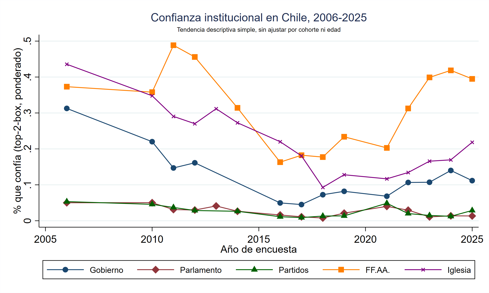
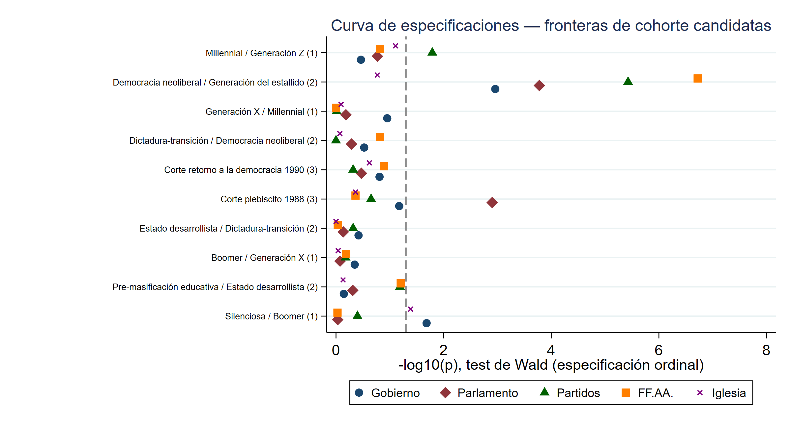
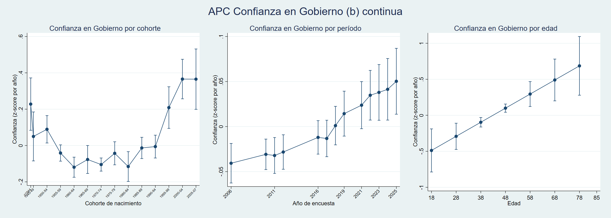
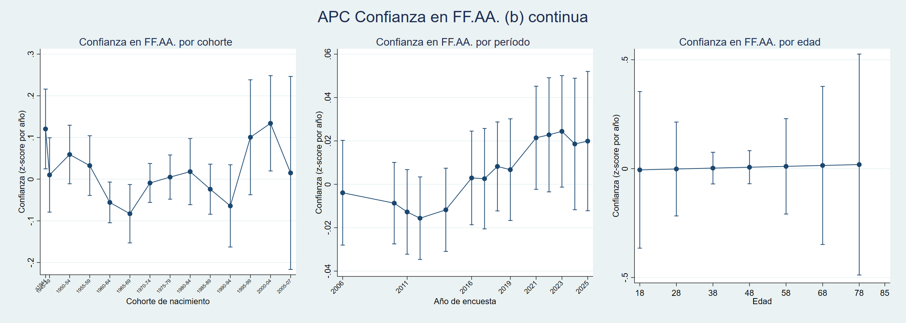
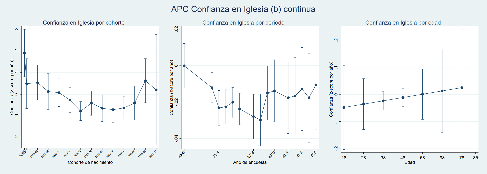
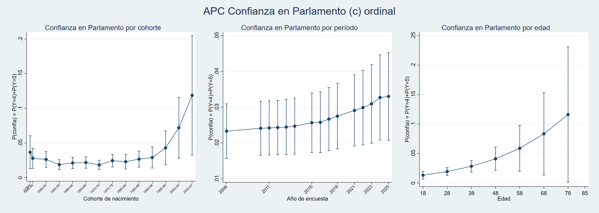
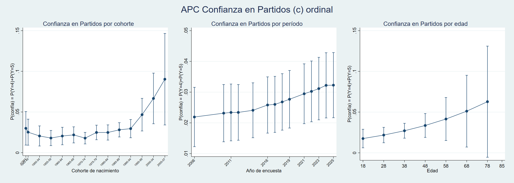

# La confianza ya viene: edad, cohortes y períodos en la confianza institucional del Chile de los últimos 20 años

Gonzalo Bustamante Rojas & Alonso Quintero Contreras

<sub>Ponencia aceptada en el 4to Congreso Latinoamericano de Ciencias Sociales y Gobierno de la Triada 2026 (PUC Chile / Universidad de los Andes Colombia / Tec de Monterrey), 1-2 de octubre de 2026, campus Ciudad de México.</sub>

## General

Análisis edad-período-cohorte (APC) de la confianza institucional en Chile (Gobierno, Parlamento, Partidos, Fuerzas Armadas, Iglesia), usando el panel armonizado de la Encuesta Bicentenario PUCV (2006-2025). La pregunta central:

*¿Existe una ruptura generacional real en la confianza institucional chilena, distinta del efecto de la edad o la coyuntura del momento (efecto de período), y si existe, dónde se ubica?*

por lo tanto:

> **1. ¿Existe algún efecto de cohorte?**
>
> **2. ¿Dónde está exactamente el quiebre?**

*Variables dependientes*:

Se utilizaron escalas de confianza estilo Likert 1-5.

| Institución | N observaciones | Olas con datos | Años sin dato |
|---|---|---|---|
| Gobierno | 24.421 | 13 / 18 | 2007, 2008, 2009, 2013, 2014 |
| Parlamento | 28.292 | 15 / 18 | 2007, 2008, 2009 |
| Partidos | 26.306 | 14 / 18 | 2007, 2008, 2009, 2013 |
| FF.AA. | 26.354 | 14 / 18 | 2007, 2008, 2009, 2013 |
| Iglesia | 28.375 | 15 / 18 | 2007, 2008, 2009 |

<p align="center"></p>

*Modelado*

Se estimaron tres especificaciones multinivel de las variables dependientes en paralelo (binaria top-2, continua z-score, ordinal completa), con edad, sexo, educación y nivel socioeconómico (NSE) como controles, sobre una base de cohortes quinquenales y controles de sexo, educación y nivel socioeconómico.

La propuesta de análisis generacional se hace de tres esquemas de análisis a partir de la literatura (1) taxonomía generacional importada (Silenciosa/Boomer/Generación X/Millennial/Generación Z), popular en reportes chilenos (Didier, 2017; del Solar & Fernández, 2024) criticada por ser fronteras sin anclaje en la experiencia histórica local; (2) una periodización histórico-local propia (Pre-masificación educativa, Estado desarrollista, Dictadura-transición, Democracia neoliberal y Generación del estallido), inspirada en el argumento de Araujo & Martuccelli (2012) de que la subjetividad se forma en condiciones históricas concretas y extendida con la lógica de "años impresionables" de Mannheim (1928) y Krosnick & Alwin (1989); y (3) un corte único de edad (Osborne, Sears & Valentino, 2011; Neundorf, 2017; Balcells y Villamil, 2026) con dos cortes.

## Resultados

pt1. ¿existe un "efecto" de cohorte?

Para responder esta parte de la pregunta, se aplicó un test de Wald conjunto sobre los 13 coeficientes de las cohortes quinquenales contra la base (H0: todos son cero a la vez), calculado sobre el mismo modelo completo. El test resultó significativo en las 15 combinaciones de institución y especificación. Todas las combinaciones cruzan el umbral de significancia. Hay, en efecto, algún efecto de cohorte que localizar en las cinco instituciones y en las tres especificaciones.

pt2. ¿Dónde existe un quiebre?

Para esta parte se aplican 225 tests de frontera que comparan los tres esquemas generacionales entre sí. Dentro del esquema teórico-local se testean dos cosas distintas: primero, si los quinquenios que un mismo bloque agrupa bajo una sola etiqueta (por ejemplo, "Democracia neoliberal 1980-1994") son estadísticamente indistinguibles entre sí (cinco pruebas "dentro-bloque"), y segundo, si los quinquenios a ambos lados de cada frontera entre bloques sí difieren, cuatro pruebas "de frontera", en 1949/1950, 1964/1965, 1979/1980 y 1994/1995. En paralelo se testean las cuatro fronteras de la taxonomía importada (Silenciosa/Boomer, Boomer/X, X/Millennial, Millennial/Z) y las dos del esquema de corte único. Todo esto se repite en las cinco instituciones y en las tres especificaciones de variable dependiente, lo que da los 225 tests.

<p align="center"></p>

De todas las fronteras candidatas, solo una sobrevive de forma robusta a la identificación de la ruptura generacional: 1994/1995, la Generación del estallido. Robusta en las tres especificaciones para Gobierno y FF.AA.; robusta en continua y ordinal para Parlamento y Partidos; en Iglesia el patrón es mucho más débil y depende de la especificación.

Respecto al análisis edad-periodo-cohorte, transversal a las instituciones aparece un patrón similar en términos de cohorte, una caída o base baja entre las cohortes nacidas entre mediados de los 50 y comienzos de los 90, con un repunte hacia en las cohortes más jóvenes (1995-99; generación del estallido). Esta barrera es consistente con lo sostenido con los test de wald. Respecto a las magnitudes, es la institución del gobierno la que muestra un patrón más claro que el resto. Cae sostenidamente desde las cohortes más longevas para recuperarse en el quinquenio de 1995-99. Para los efectos de periodo, algo bastante más plano y con tendencia positiva sostenida en las cuatro instituciones donde el coeficiente de período tiene algo de forma clara (Gobierno, FF.AA., Parlamento, Partidos suben de forma gradual 2006->2025, sin el hundimiento marcado de mediados de la década de 2010)

Para la edad, los coeficientes sólo son significativos en Gobierno y Parlamento, pero vale la pena precisar la forma, no solo la significancia. En ambas el patrón es cóncavo, la confianza sube con la edad pero a un ritmo decreciente, no en línea recta, el salto de 18 a 40 años es proporcionalmente mayor que el de 60 a 80. En magnitud, Gobierno tiene el gradiente más pronunciado de las cinco instituciones, mientras que para el parlamento, aun siendo significativo, tiene un rango mucho más comprimido en términos absolutos porque está en escala de probabilidad ordinal (de 0,015 a 0,11). FF.AA. es la única de las cinco donde el panel es visualmente plano y estadísticamente nulo entre gráfico y tabla.

<p align="center">
<a href="Principal/1b_continua_gob.png"></a>
<a href="Principal/1b_continua_ffaa.png"></a>
<a href="Principal/1b_continua_igl.png"></a>
<a href="Principal/1c_ordinal_parl.png"></a>
<a href="Principal/1c_ordinal_part.png"></a>
</p>

<sub>Nota: Se testeó normalidad tanto de la distribución de los residuos individuales del modelo continuo (z-score) como la distribución de los 13-15 efectos aleatorios de período (uno por año encuestado). A nivel de período, la única institución con no-normalidad estadísticamente significativa es iglesia, mientras que parlamento y partidos (las peores a nivel individual) salen perfectamente normales a nivel de período, es decir, la no-normalidad de parlamento/partidos se sitúa cada persona dentro de un año, no en cómo varía el promedio de un año a otro, mientras que en Iglesia pasa lo contrario. Muy probablemente un año puntual (el escándalo de abusos de 2018 es el candidato más obvio) actuando como outlier en la serie temporal.</sub>

Otros hallazgos:

El gradiente NSE es sistemático y significativo en las cinco instituciones: comparado con el grupo alto (categoría de referencia omitida), el grupo bajo (D/E) tiene entre 30% y 40% menos probabilidad de confiar en Gobierno (OR=0,584), Parlamento (0,635) y Partidos (0,643), con FF.AA. algo más moderado (0,793) e Iglesia también significativo pero más débil (0,856). Gradiente evidentemente monotónica. A menor NSE, menor confianza, sin excepciones, y en magnitud es comparable o mayor que el salto generacional.

## Estructura del repositorio (mirror del Dropbox)

```
Análisis final/
├── README.md
├── dofile final confianza institucional.do     # script único: las 15 secciones completas del análisis
├── Resultados completos - Confianza institucional (con NSE).docx
│
├── Principal/                                   # tablas y gráficos centrales
│   ├── tabla_1c_ordinal.rtf
│   ├── tabla_4_wald_cohortes.csv                # 225 tests de frontera (pt2)
│   ├── lr_bargsted_maldonado.csv                # test de Wald conjunto (pt1)
│   ├── 1b_continua_{gob,ffaa,igl}.png / 1c_ordinal_{parl,part}.png
│   ├── 4_brecha_estallido.png
│   ├── 5_forest_encrucijadas.png / 5_fronteras_quinquenales.csv
│   ├── 6_tendencia_temporal.png
│   ├── 7_brecha_estallido_prob.png / _pvalues.csv
│   ├── 8_specification_curve.png
│   ├── 9_wald_momento1_cohorte.png
│   ├── cobertura_variables_detalle.csv / _resumen.csv
│   └── Metodologia_y_hallazgos*.docx             # borradores del manuscrito
│
├── Auxiliar/                                    # robustez y diagnóstico
│   ├── tabla_1a_binaria.rtf / tabla_1b_continua.rtf
│   ├── tabla_2{a,b,c}_*_robustez_teorica.rtf
│   ├── tabla_3_diagnostico_normalidad.csv
│   ├── diagnostico_omitidas_cohort5.csv
│   └── 1a_binaria_*.png / 1b_continua_{parl,part}.png / 1c_ordinal_{gob,ffaa,igl}.png / 3_normalidad_*.png
│
├── Cohortes teóricas/                           # comparación descartada: cohort_teorica (5 bloques)
│   └── 1{b,c}_{continua,ordinal}_teo_*.png
│
└── Construcción del panel/
    └── build_panel_bicentenario_armonizado.do   # arma el panel 2006-2025 a partir de las bases anuales
```
